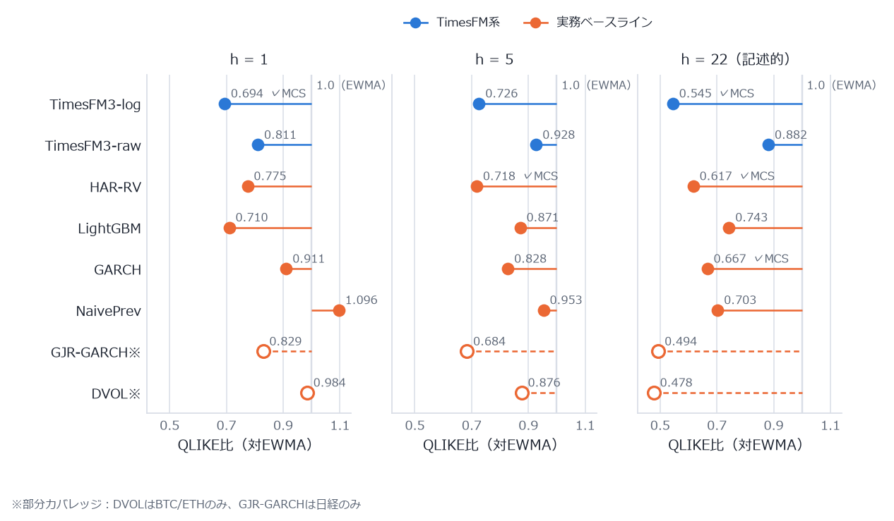
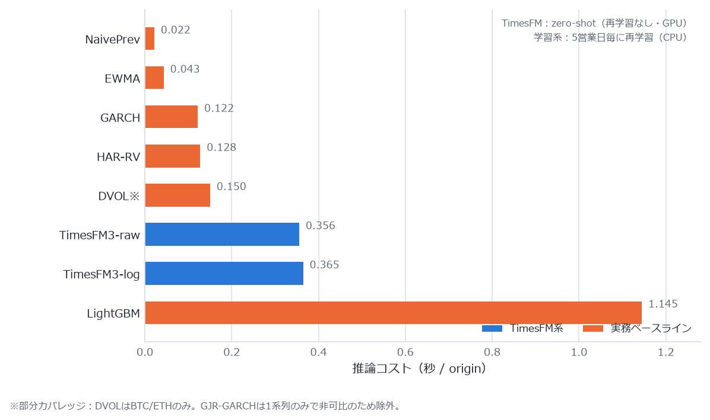
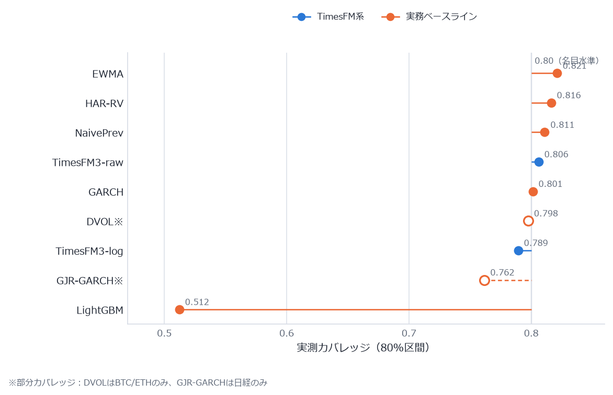
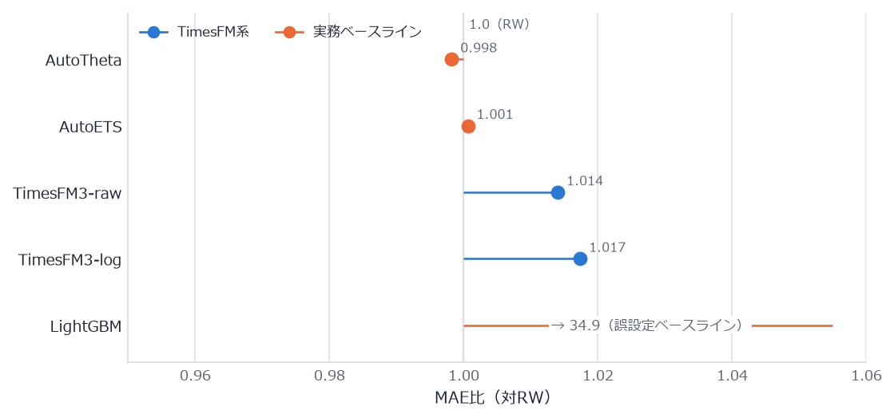
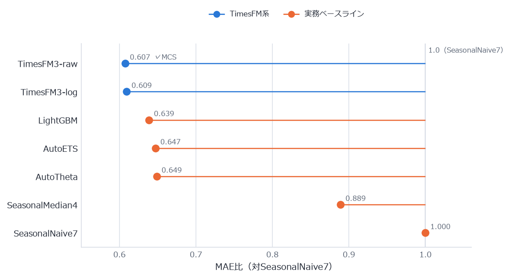

# TimesFM-3.0を金融データで実務ベースラインとガチンコさせてみた

GoogleからリリースされたTimesFM-3。時系列基礎モデルで、1回のフォワードパスで正確な多変量時系列予測を可能とするらしい。公式は fev-bench / GIFT-Eval / TIME で軒並み1位を主張している。

……という話を聞いて、既存手法と比較してベンチを取ってみることにした。

TabFMのとき、XGBoost+OptunaがTransformer系の表予測モデルとそこまで変わらない——というか速度的にはXGBoost+Optunaが圧倒していたのを見ていたので、**ベンチを取らないと安心できない**。基礎モデルの「リーダーボード1位」と「実務で置き換える価値」の間には、だいたい深い溝がある。

## TL;DR

- **ボラティリティ予測（本命）**: 翌日予測はTimesFM（log入力）がトップ。ただし**週次ホライズンでは20年前の古典・HAR-RV（ただの線形回帰）が統計的に単独勝ち**。ホライズンで分割統治になった
- **価格予測**: 誰もRandom Walkに勝てない。TimesFMも勝てない（理論どおり。ここで「勝てた」と言い出すベンチは疑ったほうがいい）
- **出来高予測**: TimesFMの圧勝
- **速度**: ゼロショットなので**再学習ループを持つLightGBMより速い**。TabFMのときとは景色が逆
- **分布予測の較正はTimesFMが唯一まとも**。LightGBM+conformalは80%区間のはずが実測51%で崩壊
- ただし**「TimesFMの勝ち」には全部アスタリスクが付く**（後述の学習データ汚染問題）

## ベンチ設計：公式ベンチをなぞっても意味がない

公式のGIFT-Eval等は汎用データ×基礎モデル同士の比較が中心なので、意図的に外した設定にした。

| | 内容 |
|---|---|
| データ | 金融のみ。ECB為替8通貨・日本国債金利6年限・日経225・暗号資産8銘柄（Coinbase 5分足から実現ボラ構築）・Deribit DVOL |
| 比較対象 | Random Walk / EWMA / GARCH・GJR / **HAR-RV** / **インプライドボラ回帰** / LightGBM / AutoETS・Theta という「実務でまず出てくる面々」 |
| タスク | P=価格レベル（誠実性テスト）、V=実現ボラティリティ（本命）、U=出来高 |
| 評価 | QLIKE・MASE系・80%区間カバレッジ・VaRバックテスト（Kupiec/Christoffersen）・Model Confidence Set・実行前検出力計算 |
| 期間 | 2025-01〜2026-08、rolling origin（ボラh=1は日次605時点） |

雑にやると雑な結論しか出ないジャンルなので、設計段階で **Codex（GPT-5.6）とClaude Opusに敵対的レビューを2ラウンド**やらせて、出てきた指摘（QLIKEのプロキシノイズ床、分位のホライズン加算禁止、GARCHの推定対象整合、方向精度指標の自己破綻など）を全部設計に反映してから凍結した。ハイパラは2024年以前の開発窓で固定、テスト窓を見てからの変更は禁止。

一番大事なのはこれ：

> **TimesFM-3.0は2026-08-28リリースで学習データのカットオフが非公開。つまりテスト期間（2025-01〜2026-08）を学習で見ている可能性を否定できない。だから「メイン窓でTimesFMが勝っても能力の証拠として扱わない」と実行前に宣言した。** 情報として強いのは「負け」と「較正の質」だけ。

## 結果1：本命のボラティリティ予測 — ホライズンで分割統治

QLIKE（ボラ予測の標準損失）をEWMA基準の比で見る。1.0より左が「EWMAより良い」。

- **h=1（翌日）**: TimesFM-log が比0.694で全系列勝ち、Model Confidence Setに単独残留。LightGBM（0.710）が僅差で追う
- **h=5（週次）**: **HAR-RVが単独残留**。TimesFMは統計的に除外された（p=0.043）。HAR-RVは2009年の論文の、説明変数3個の線形回帰である
- **h=22（月次）**: 検出力不足で判別不能（これは実行前のMDE計算どおりなので想定内）。ただし**インプライドボラ（DVOL）回帰が比0.478で別格**。オプション市場の情報には誰も勝てない

h=5の負けは重要で、**汚染では説明がつかない**（学習データを見ていたとしても負けたのだから）。「1回のフォワードパスで多変量予測」の看板に対して、実務の週次ボラ予測ではただの線形回帰に負ける、というのが今回一番の収穫。

## 結果2：速度 — TabFMのときと景色が逆

TabFMのベンチではXGBoost+Optunaが精度で並んで速度で圧勝、という結末だった。今回はどうか。

**今回はTimesFMのほうがLightGBMより速い**（0.36秒 vs 1.15秒/origin）。理由は単純で、ゼロショットには再学習ループがないから。LightGBMの1.15秒の大半は5営業日毎の再学習コストの償却で、推論自体は一瞬。つまり：

- 表データのとき: 「基礎モデルは学習も推論も重い、GBDTは両方軽い」→ GBDT圧勝
- 時系列ゼロショット: 「基礎モデルは学習ゼロ、GBDTは再学習が定期発生」→ **運用形態によっては基礎モデルが軽い**

「新しい系列が来るたびに再学習パイプラインを回したくない」という状況なら、ゼロショットで翌日ボラがこの精度・この速度で出るのは普通に価値がある。TabFMのときのような門前払いにはならなかった。

## 結果3：分布予測のまともさ — conformalの崩壊とTimesFMの較正

点予測だけでなく80%予測区間も見た。名目80%に対して実測がどうか。

- **LightGBM + conformal（mlforecast PredictionIntervals）は実測51%で崩壊**。ボラのクラスタリングがconformalの交換可能性前提を壊す、という敵対的レビューでの指摘がそのまま実証された。点予測は強いのに区間は使い物にならない
- 10% VaRのバックテスト（Kupiec + Christoffersen）を3系列×3検定で**全部通過したのはTimesFMの2変種だけ**。EWMAもGARCHも「違反が時間的に固まる」独立性検定で落ちる

リスク管理用途で分布の尾を使うなら、ここはTimesFMの明確な強み。しかも較正の質は汚染では作りにくい性質のものなので、比較的信用できる所見だと思っている。

## 結果4：価格予測 — 誰も勝てない（そして勝てないのが正しい）

対Random Walk相対MAEはAutoTheta 0.998、AutoETS 1.001、TimesFM 1.014。**全員誤差1〜2%以内に団子で、MCSは「誰も区別できない」を返した**。Meese–Rogoff（1983）以来の定説どおり。

TimesFMの名誉のために言うと、非劣性検定（±5%マージン）はh=1で全資産グループ通過している。為替の翌日レートをゼロショットで入れてRandom Walk±1.4%に収まるのは、壊れていないことの証明としては十分。なお日本国債金利のh=1ではRWに統計的に有意に負けた（金利の持続性があれば勝てるかも、という事前仮説は棄却）。

余談：グローバルLightGBMを価格レベルにそのまま当てると比34.9で大破する（スケールの違う系列を混ぜたグローバル学習が原因）。実務家ならリターンで組むところだが、テスト後の再設定は事前登録違反になるので「誤設定ベースライン」として晒したまま残してある。

## 結果5：出来高予測 — TimesFMの圧勝

比0.607でMCS単独残留、Holm補正後p=0.031。週次季節性のある系列はゼロショットでもよく取れる。ただしこれも「勝ち」なので汚染アスタリスク付き。

## で、XGBoost事件は再来したのか

**半分だけ再来した**、が結論。

| 観点 | TabFMのとき | 今回（TimesFM-3.0） |
|---|---|---|
| 精度 | GBDTと大差なし | ホライズン次第。翌日ボラ・出来高は最強格、週次ボラは線形回帰に負け、価格は全員敗北 |
| 速度 | GBDT圧勝 | **ゼロショット側が速い**（再学習不要のため） |
| 分布・較正 | — | TimesFMが唯一まとも。conformal LightGBMは崩壊 |
| 導入判断 | 「GBDTでよくない？」 | 「再学習パイプラインを持ちたくない箇所と、分布が要る箇所には筋がある」 |

「基礎モデル、結局ベースラインでよくない？」と一刀両断できる結果にはならなかった。ただし週次ボラでHAR-RV（線形回帰、実装30行、推論0.13秒）に負けている以上、**「実務ベースラインを窓から投げ捨てていい」という結果でもまったくない**。

## 注意点（ここ読まずに引用しないで）

1. **学習データ汚染**: テスト期間がTimesFMの学習期間と重なっている可能性が高い。「TimesFMの勝ち」は全部この留保付き。逆に「負け」と「較正」は汚染で説明できないので固い
2. **ライセンス**: TimesFM-3.0の重みは**非商用ライセンス**。この時点で「実務投入」には別のハードルがある
3. 被験はTimesFM-3.0の単変量ゼロショット構成のみ。TSFM一般の話には拡大できない
4. 汚染フリーの本評価は、リリース日（2026-08-28）以降のデータだけを使うclean windowで**毎月追試**する設計にしてある。初回の意味ある読みは2026年12月頃。翌日ボラのTimesFM優位がclean windowで消えるかどうか——このベンチの本当の答えはそこで出る

## 環境ではまったところ（供養）

- uv標準のpython-build-standaloneが、TLS検査を挟むネットワーク環境と組み合わさると`OPENSSL_Uplink: no OPENSSL_Applink`で**全HTTPSが即死**する。python.orgビルドに差し替えて解決
- Coinbaseは`Python-urllib`のUAを403で弾く（requestsのUAは通る）
- Deribitの`continuation`は「次のstart」ではなく「次のend」（最新から過去へページング）
- 財務省の国債金利CSVは和暦・cp932で、**1980年代は土曜日にもデータがある**（当時は土曜営業）。週末データを不正扱いする監査を書くと1970年代から519件引っかかる

---

*ハーネス（データ取得・監査・バックテスト・検定・レポート、テスト79本）はCodexにコードを書かせてClaudeがレビュー・実行する体制で1日で構築。設計の事前登録・敵対的レビュー記録・全数値はリポジトリ（tsfmbench）参照。*
